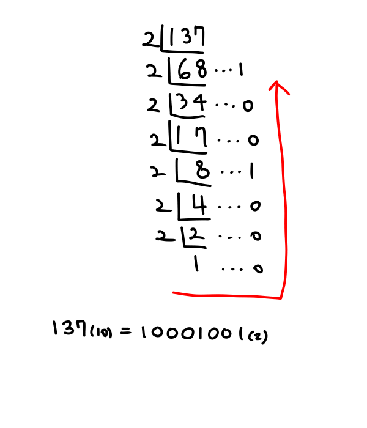
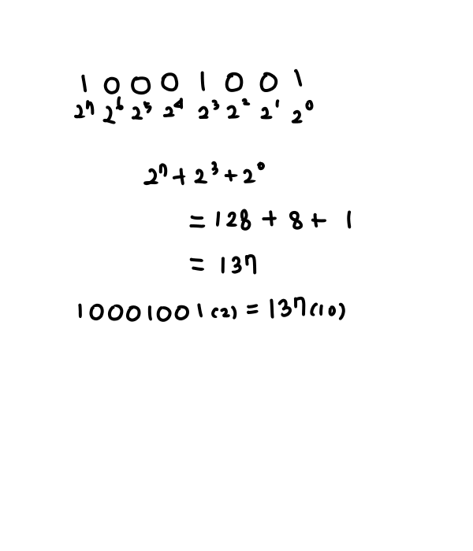

# 진수

> 자주 사용하는 진수 

- 2진수, 8진수, 10진수, 16진수

> 10진수를 타 진수로?

- 타진법의 수로 나눈 뒤 나머지를 거꾸로 읽음

> 타진수를 10진수로?

- 각 자릿값을 해당 진수의 값을 곱하여 계산 (소수점도 동일하게 적용)

> 특히 2진수는 8진수, 16진수 변환 용이

- 2진수 3자리씩 묶으면 8진수 / 8진수 3자리씩 나열하면 2진수
- 2진수 4자리씩 묶으면 16진수 / 16진수 4자리씩 나열하면 2진수

#### 음의 정수 표현

> 1의 보수 

- 부호와 절대값으로 표현된 값에서, 

  부호를 제외한 나머지 비트를 1은 0으로 0은 1으로 변환

  -6 : 1 0 0 0 0 0 0 0 0 0 0 0 0 1 1 0     : ==부호와 절댓값 표현==

  -6 : 1 1  1  1  1  1  1  1  1  1  1  1  1 0 0 1    :  ==1의 보수표현==

  **최상의 비트가 1이면 음수**

> 2의 보수

- 1의 보수 방법으로 표현된 값의 최하위 비트에 1을 더함

  -6 : 1 1  1  1  1  1  1  1  1  1  1  1  1 0 1 0    : ==2의 보수표현==

  